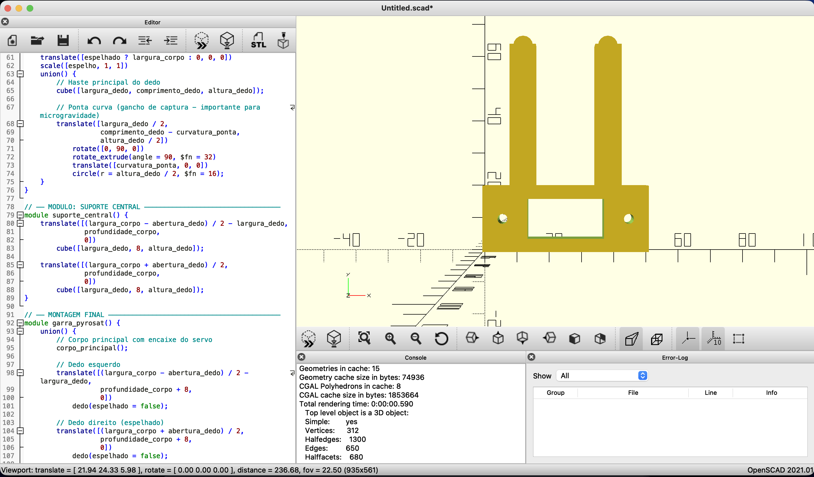
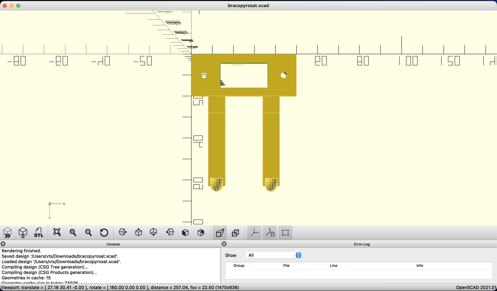
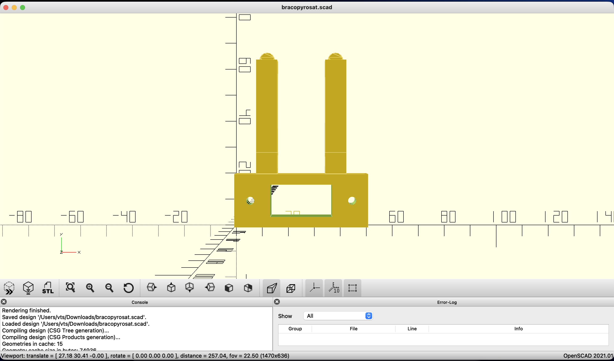
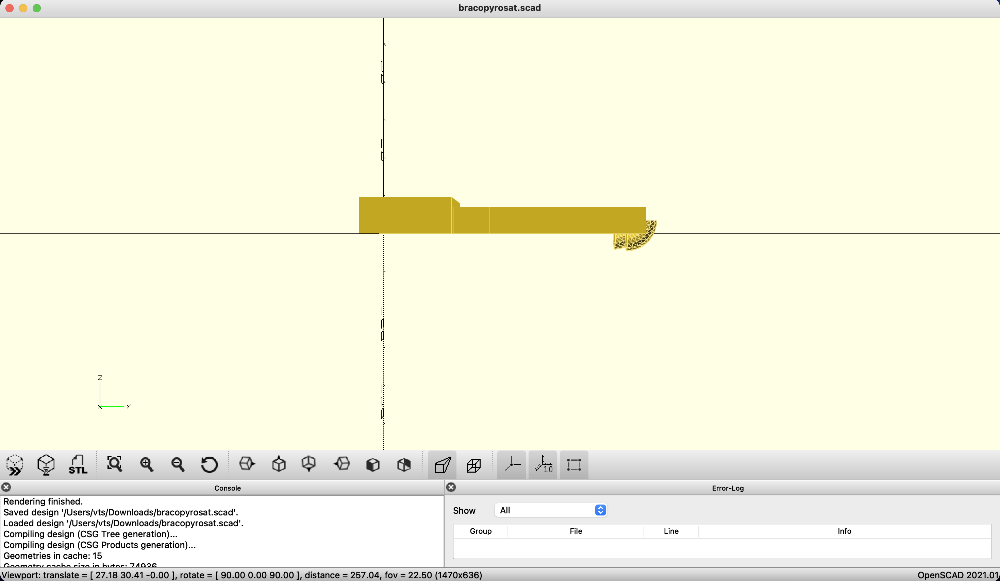
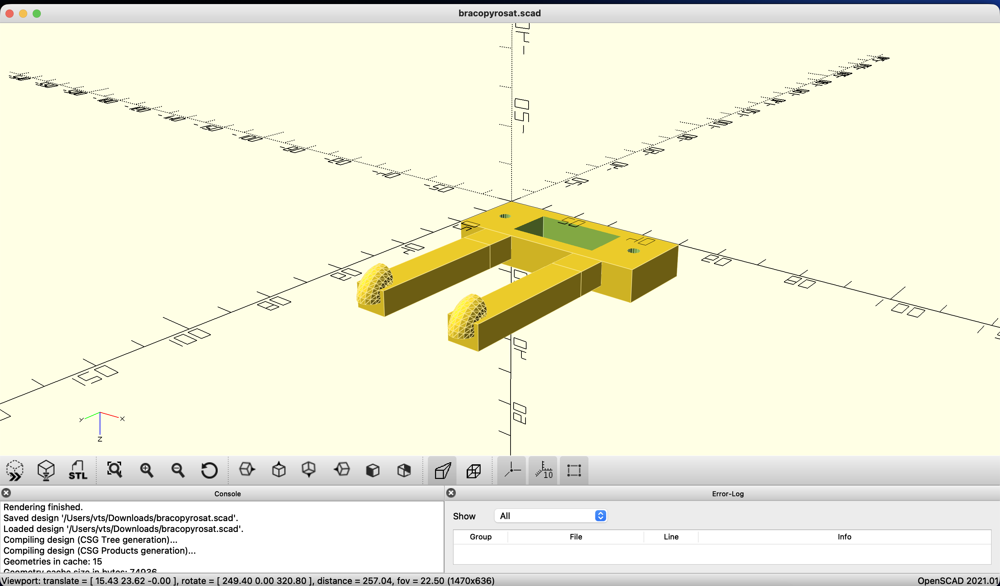

# pyrosat-pbml
# PyroSat - Braço Robótico de Posicionamento de Sensor Térmico

**Disciplina:** Project-Based Maker Lab (PBML)  
**Global Solution 2026 - FIAP - Engenharia de Software - 4 Ano**

## Integrantes

| RM | Nome |
|---|---|
| RM98827 | Andre Soler |
| RM551869 | Fabrizio Maia |
| RM96869 | Rodrigo Paixao |
| RM551684 | Victor Asfur |
| RM550390 | Vitor Shimizu |

## Contexto do Projeto

O PyroSat é uma plataforma de alerta precoce de queimadas que usa dados satelitais da NASA para monitorar o território brasileiro. Este protótipo simula o mecanismo de reposicionamento do sensor infravermelho VIIRS de um nanossatélite da constelação PyroSat.

O servo vertical (comandos U e D) simula a inclinação do sensor em relação ao solo. O servo horizontal (comandos O e C) simula o mecanismo de travamento de posição do scanner. O LED de status indica quando o sistema está em operação.

## Acesso ao Simulador

Link público do circuito no Tinkercad:  
https://www.tinkercad.com/things/hUp4KhdnFGA

## Circuito

**Componentes:**
- 1x Arduino Uno R3
- 2x Micro Servo 9g
- 1x LED
- 1x Resistor 220 ohms

## Como Operar o Braço

### 1. Abrir o simulador
Acesse o link do Tinkercad acima e clique em **Start Simulation**.

### 2. Abrir o Monitor Serial
No canto superior direito da tela do Tinkercad, clique no botão **Serial Monitor** (icone de tela pequena).

### 3. Configurar o baud rate
No Monitor Serial, verifique se o baud rate esta configurado para **9600**. Se necessario, ajuste no seletor na parte inferior da janela.

### 4. Digitar os comandos
No campo de texto do Monitor Serial, digite uma letra e pressione **Send** ou **Enter**.

## Tabela de Comandos

| Comando | Acao | Servo | Angulo |
|---|---|---|---|
| `U` | Sensor inclinado para zona norte | Vertical (pino 9) | 135 graus |
| `D` | Sensor inclinado para zona sul | Vertical (pino 9) | 45 graus |
| `O` | Travamento liberado | Horizontal (pino 10) | 90 graus |
| `C` | Posicao travada | Horizontal (pino 10) | 0 graus |
| `S` | Varredura automatica completa | Horizontal (pino 10) | 0 a 180 graus |
| `H` | Retorna a posicao neutra | Ambos | 90 graus |

> O LED no pino 13 acende durante cada movimento e apaga quando o servo para.

## Especificacoes Tecnicas

- Tensao de operacao dos servos: 5V (fornecida pelo Arduino)
- Pino servo vertical: 9 (PWM)
- Pino servo horizontal: 10 (PWM)
- Pino LED: 13
- Baud rate Serial Monitor: 9600

## Estrutura do Repositorio

```
pyrosat-pbml/
├── src/
│   └── pyrosat_arm.ino
├── model/
│   ├── bracopyrosat.scad
│   └── bracopyrosat.stl
├── images/
│   ├── circuito_tinkercad.png
│   └── modelo3d1.png ... modelo3d5.png
└── README.md
```

## Modelagem 3D

**Software utilizado:** OpenSCAD

A garra foi modelada com variaveis parametricas que permitem ajustar todas as dimensoes da peca alterando apenas os valores no inicio do codigo.

**Variaveis principais:**
- `largura_corpo` - largura total da garra (padrao: 50mm)
- `comprimento_dedo` - comprimento de cada dedo (padrao: 35mm)
- `abertura_dedo` - espaco de captura entre os dedos (padrao: 18mm)
- `servo_largura` / `servo_profundidade` - encaixe do servo 9g (23mm x 12mm)

**Detalhes do design:**
- Corpo base com encaixe preciso para servo de 9g
- Dois dedos com ganchos curvos para captura em microgravidade
- Furos M3 para fixacao mecanica
- Design autoral baseado em garras de captura de satelites reais

### Imagens do Modelo 3D






